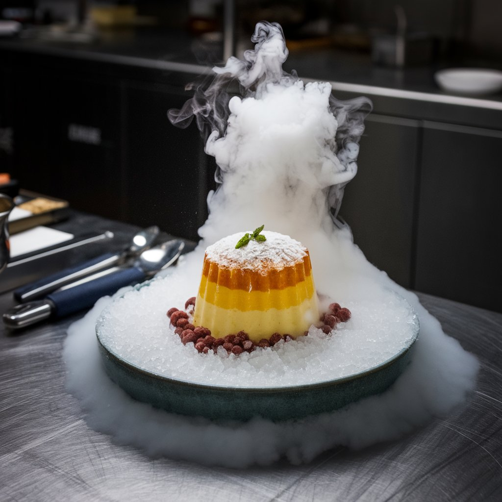

# First

words words words words words words words

1. [List 1](Example)
2. [List 2 won't work cause I put spaces instead of dashes in actual file name](Thought-expirement-example)
3. [List 3](README.md)
4. [List 4](README.md)
5. [Element 5](Example)

Example link(spongebob on youtube): [here](https://youtu.be/e3fS1SOwLWU?si=zqapl_hB7tp6oMVL)

## Philosophical Thought

1. Random food foods

This is a delicious dessert made with layers of flavored gelatine and served on a bed of ice. It's a perfect treat for any occasion!

3. Violin
4. Thesus
5. Brains

## Science Fiction

## Classical Storytelling
